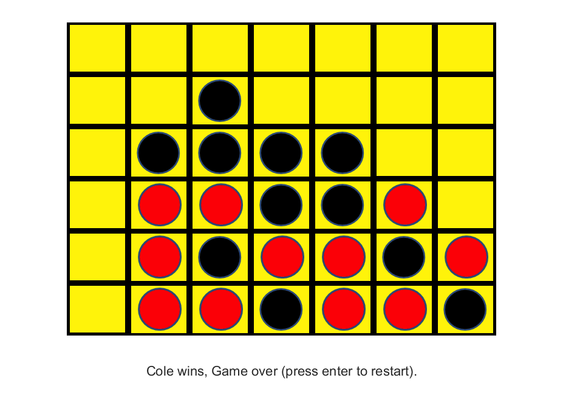

# ConnectFour
A 2D game in MATLAB based off the class game of Connect Four. Leveraging a lightweight game engine and PNG assets, showcasing skills in logic and interative systems.

Steps to Play:

1. Ensure a proper MATLAB download and functioning license
2. Downloaded provided .m files (ensure they are in the same folder)
3. Open "SDPFinalCode"
4. Click "RUN" and follow prompts
5. Enjoy!

The following are pictures to display game function:

